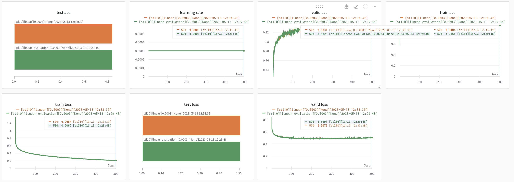

# linear evaluation and transfer learning.  
Pyorch-style linear evaluation and transfer learning for self-supervised-learned (e.g. SimCLR, SupCon, (Sup)MoCo) models.  
  
This code covers linear evaluation which freeze encoder and then updates only classifier and finetuning which updates encoder and classifier together.  

# Caution  
Make sure that ur SSL-trained model pre-processing algorithm should be same with training for linear evalaution.  
i.e. If SSL trained with [0, 1] and trained for linear evalation with [-1, 1] IDIOT.

### Note that
In pytorch `model.state_dict()` and `model.named_parameters()` are different.  
Both method gives parameters however, `state_dict()` gives more for instance `bn.running_mean`

```
import torchvision
resnet = torchvision.models.resnet18(weights = None)
print(len([name for name, param in resnet.named_parameters()]))
print(len(resnet.state_dict().values()))

resnet = torchvision.models.vgg11(weights = None)
print(len([name for name, param in resnet.named_parameters()]))
print(len(resnet.state_dict().values()))
------------------------------------------------------
62
122
22
22
```
and for linear evaluation encoder have to be `encoder.eval() state` so that batchnorm, dropout tunred to evaluation mode.  


# Freeze Network  
For linear evaluation, other codes have two factor.  
First, when setting optimizer feed only `classifier.parameters()` so that optimizer never updates `encoder`.  
Second, when forward step in training phase, inputs undergo encoder wrapped `torch.no_grad()`.  
This make backpropagation cannot reach to encoder.  

However the codes are unable to transfer learning.  
To this end, I feed optimizer both `classifier.parameters()` and `encoder.parameters()` with `collections.chain`.  
I referred [here](https://discuss.pytorch.org/t/giving-multiple-parameters-in-optimizer/869/8)    
And did not used `torch.no_grad()` while training.  

To double-check, in training phase for linear evaluation, I copied initial parameter and check whether `encoder.parameters()` change or not.  


# Code validation  
This repo only supports linear evaluation and finetuning method not self-supervised learning.  
I tried reproduce other repos to validate my code.

### SupCon  
I tried [SupCon](https://github.com/HobbitLong/SupContrast).  
But It has many [performance issuses](https://github.com/HobbitLong/SupContrast/issues/132).  
So I tried another one  

### SimCLR  
2 hours...  
I tried [SimCLR](https://github.com/Spijkervet/SimCLR/tree/master).  
Very kind repo see [config](https://github.com/Spijkervet/SimCLR/blob/master/config/config.yaml).  

1. Valid on STL10




2. Valid on CIFAR10  
  
  
